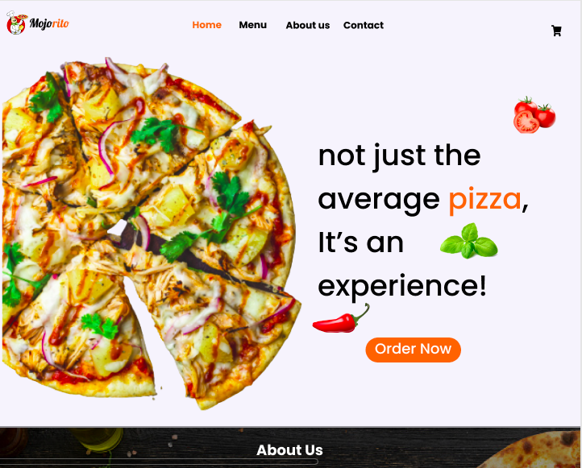

# Mojorito Pizza
## 
### View the design [here](https://www.figma.com/file/x90cOf9ZZae3o4ZEyRe1Yx/Mojorito?node-id=0%3A1).
#### The app helps customers order their favourite pizza from the comfort of their home, ***2022***
#### By **Samuel Hinga**
## Description
 Pizza Mojorito has been around for decades and since the turn of the century, technology has been winning so Mojorito pizza and co decided the best way forward to serve its customers was to build them a system they can order from home. This way, sales have increased and all the feedback from the customers is been addressed co-currently.
## Setup/Installation Requirements
* One requires a browser
* type in the web link,
* click on order button,
* fill in the form on how you'd prefer your pizza
* then choose whether to pick it or have it delivered.
- The app is fully independent. To get the root code, one needs to clone the repo and add on it since its open source. A database has not been incorporated yet however, we seek to incorporate it later as we grow to more locations.
## Known Bugs
There is currently a bug on the form as one needs to click on proceed before filling the form.
## Technologies Used
The APP was first designed using Figma, then coded using HTML, CSS, JavaScript and some libraries such as JQuery, and Bootstrap5.
## Support and contact details
To contribute or reach me out in any way, email me [here](mailto:samuelkinuthia700@gmail.com)
### License
*MIT license.*
Copyright (c) 2022 **Samuel Hinga & Mojorito Pizza**